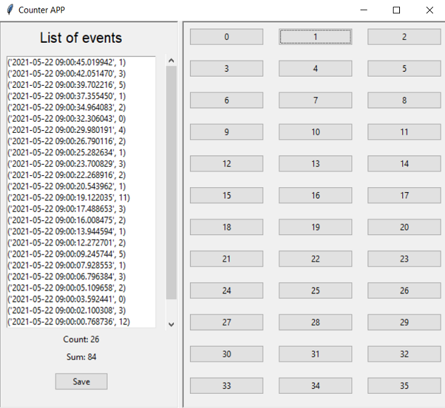

# COUNTER APP

## **Problem statement**:
Counting the number of events from an observed process (i.e. quantity, defects, speed) usually involves writing down information in paper and transcribing it later into a spreadsheet for analysis. This activity is time-consuming, especially for longer periods of observation (where the sample size increases). Additionally, counting events becomes even more challenging when the observed process must be tracked against an accurate measurement of time.

## **Solution**:
The COUNTER APP built with Python helps address this issue. A datetime object is generated every time a button is pressed from the GUI built with Tkinter. The MainApplication has a paned window to the left that displays all the events that have been registered in descending order, and shows the cumulative count and sum as well. When the user is ready to finish collecting the data, the save button allows to write all the records to a csv file in the local drive.

## **GUI**

## **Getting Started**

Use fork to download a copy of this repo into your machine.

## **Prerequisites**

See requirements.txt file

python==3.9.*
pip==21.0.*
setuptools==49.2.*

## **Authors**

* **Gabriel Borja** - *Initial work* - [GitHub link](https://github.com/gabrielborja)

## **License**

This project is licensed under the MIT License - see [MIT license](https://opensource.org/licenses/MIT) for details

## Acknowledgements

* Acheve