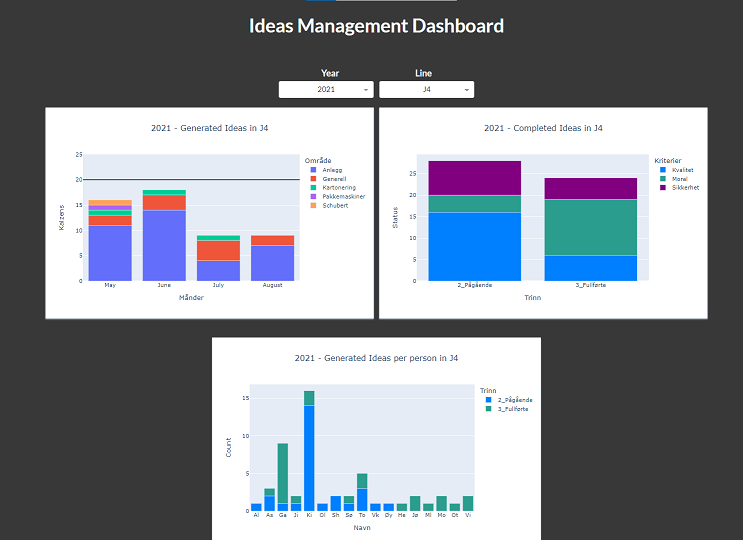

# IDEAS DASHBOARD

## **Problem statement**:
Many companies have an ideas generation system to follow up on different initiatives, from generation to implementation. Sometimes is hard to track how this system is performing, how to categorize the different ideas and present this in a visual manner so that different stakeholders can explore the overall metrics and trends.

## **Solution**:
(Pending).

## **GUI**

## **Getting Started**

Use fork to download a copy of this repo into your machine.

## **Prerequisites**

See requirements.txt file

## **Authors**

* **Gabriel Borja** - *Initial work* - [GitHub link](https://github.com/gabrielborja)

## **License**

This project is licensed under the MIT License - see [MIT license](https://opensource.org/licenses/MIT) for details

## Acknowledgements

* Acheve