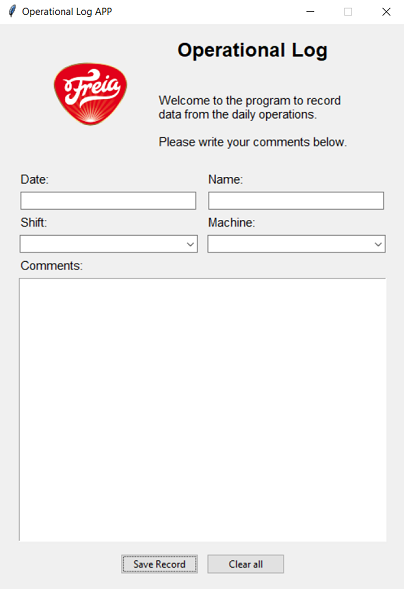

# OPERATIONAL LOG APP

## **Problem statement**:
In an industrial facility is always important to share information between shifts and be able to preserve the most relevant data in the form of records. This requirement of information can be diverse, ranging from safety records, to jobs performed by maintenance personnel, as well as comments about different machines, process parameters, stoppages, quality issues, etc. This kind of information is frequently handled in the form of paper reports, whiteboards or spreadsheets, representing a challenge into how to properly store it and preserve it. 

## **Solution**:
The OPERATIONAL LOG APP built with Python helps address this issue. The MainApplication built with Tkinter provides a user-friendly interface that allows the user to fill in the most relevant information from each shift in the form of records, and be able to save and retrieve data from a database built with SQLite3.

## **GUI**

## **Getting Started**

Use fork to download a copy of this repo into your machine.

## **Prerequisites**

See requirements.txt file

python==3.9.*
pip==21.0.*
setuptools==49.2.*

## **Authors**

* **Gabriel Borja** - *Initial work* - [GitHub link](https://github.com/gabrielborja)

## **License**

This project is licensed under the MIT License - see [MIT license](https://opensource.org/licenses/MIT) for details

## Acknowledgements

* Acheve